

## About me

Full-stack engineer with over 3 years of professional experience delivering reliable, robust, and scalable web applications. High work standards, meticulous attention to detail, and a strong drive for learning and improvement. Dependable and collaborative team member with solid interpersonal skills and an openness to discussion and feedback.

## Skills & tools

### Languages

  

    

      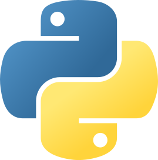
    

    

      Python
    

  

  

    

      
    

    

      PHP
    

  

  

    

      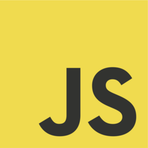
    

    

      JavaScript
    

  

  

    

      
    

    

      TypeScript
    

  

### Frameworks

  

    

      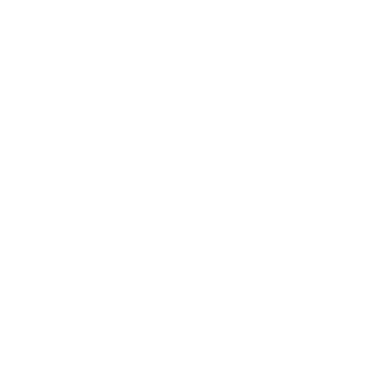
    

    

      Symfony
    

  

  

    

      
    

    

      Django
    

  

  

    

      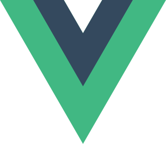
    

    

      Vue.js
    

  

  

    

      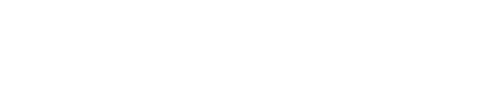
    

    

      Next.js
    

  

  

    

      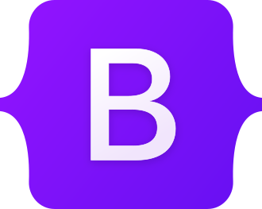
    

    

      Bootstrap
    

  

  

    

      
    

    

      Tailwindcss
    

  

### Databases

  

    

      
    

    

      MySQL
    

  

  

    

      
    

    

      Microsoft SQL Server
    

  

### Tools

  

    

      
    

    

      Git
    

  

  

    

      
    

    

      GitHub
    

  

  

    

      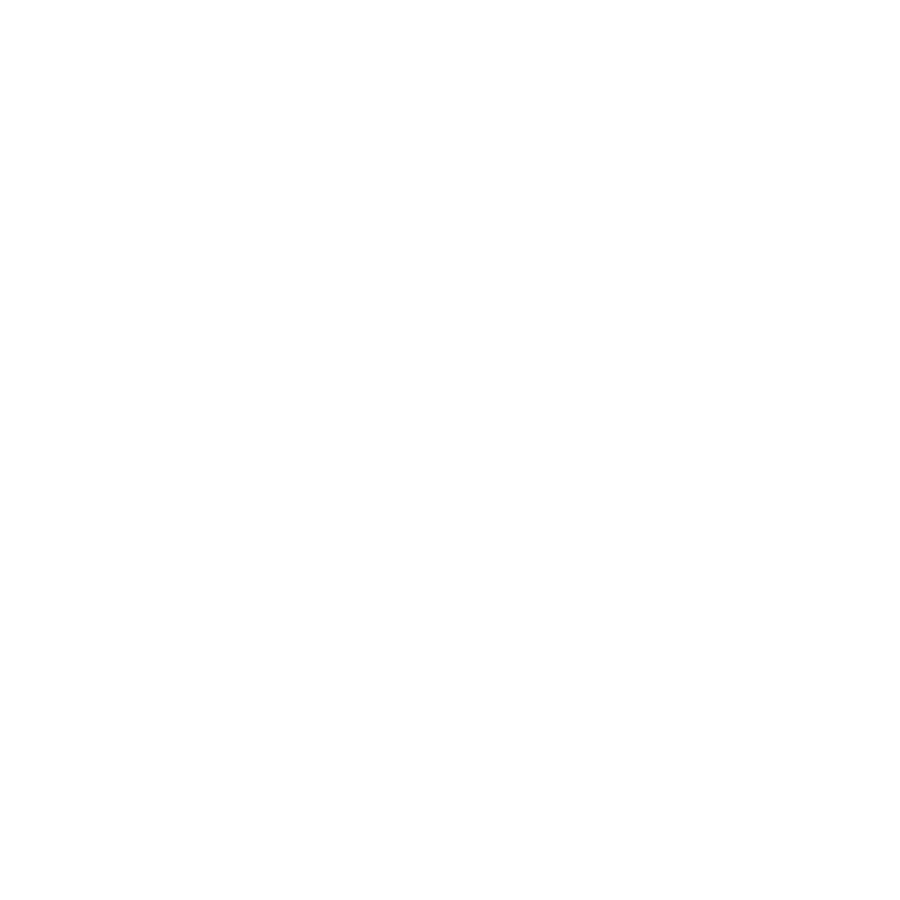
    

    

      Ansible
    

  

  

    

      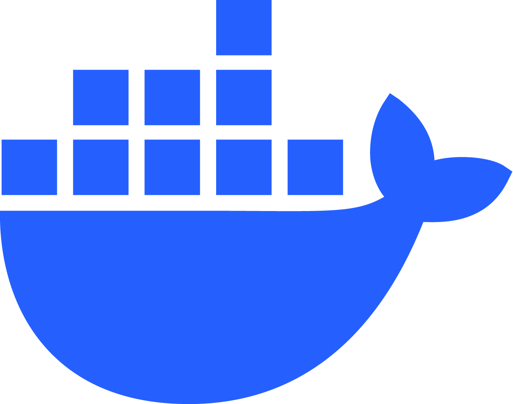
    

    

      Docker
    

  

### Platforms

  

    

      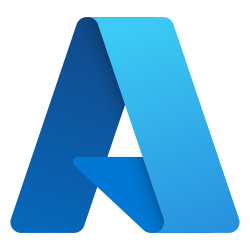
    

    

      Microsoft Azure
    

  

## Featured work

### Professional projects

#### Customer Relationship Management application

  
  
  
  

  <picture class="rounded border">
    <source srcset="assets/images/order.webp" type="image/webp" />
    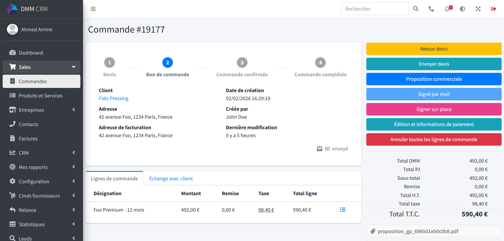
  </picture>

  <picture class="rounded border">
    <source srcset="assets/images/signature.webp" type="image/webp" />
    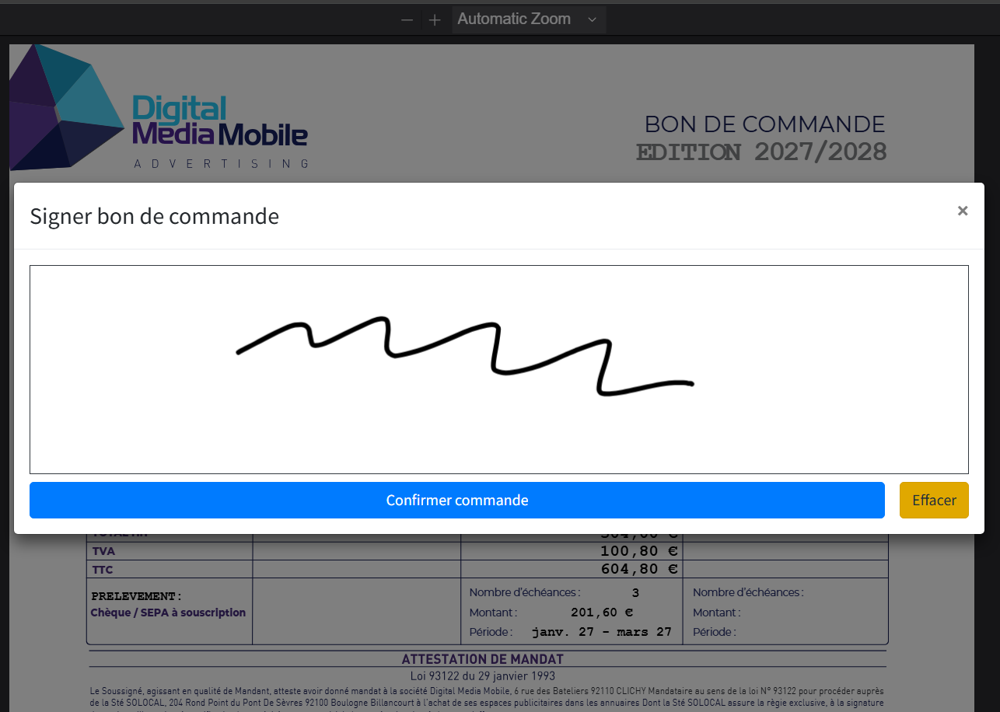
  </picture>

  <picture class="rounded border">
    <source srcset="assets/images/order_mobile.webp" type="image/webp" />
    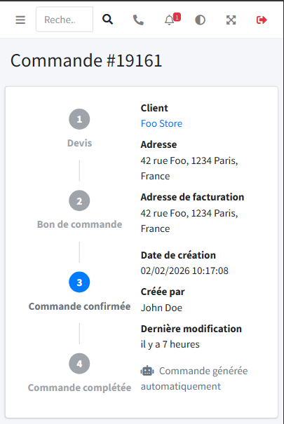
  </picture>

  <picture class="rounded border">
    <source srcset="assets/images/login.webp" type="image/webp" />
    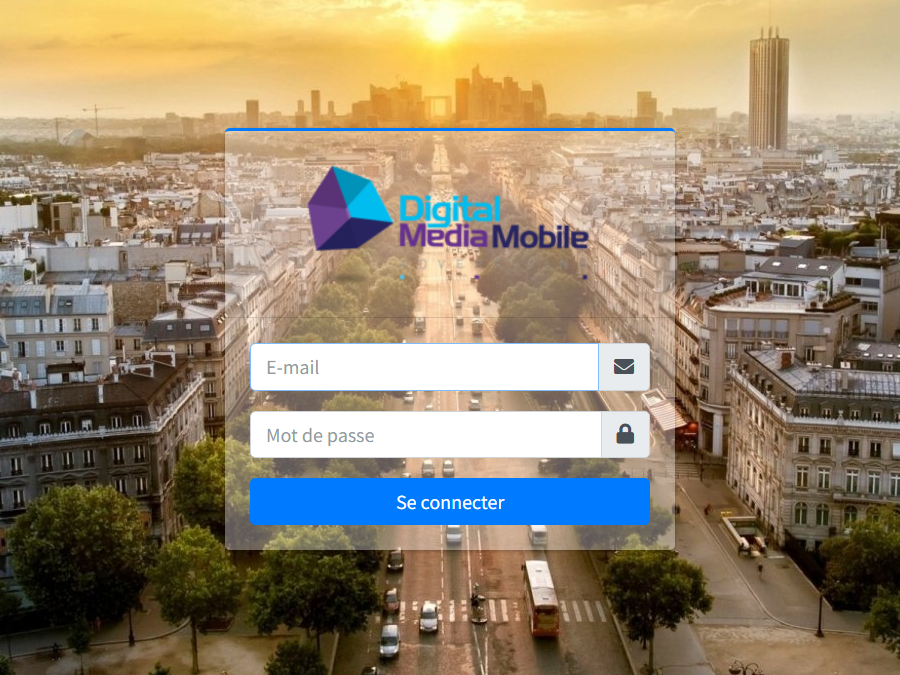
  </picture>

  <picture class="rounded border">
    <source srcset="assets/images/calendar.webp" type="image/webp" />
    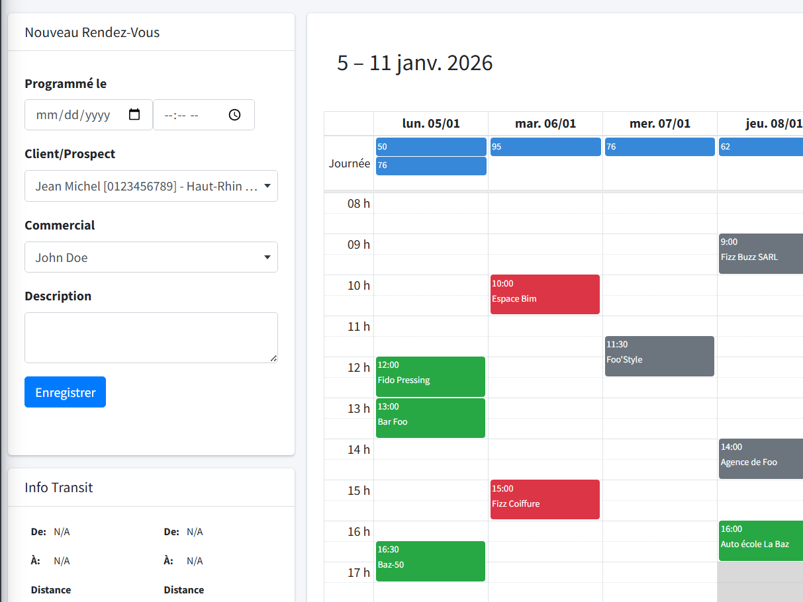
  </picture>

  <picture class="rounded border">
    <source srcset="assets/images/map.webp" type="image/webp" />
    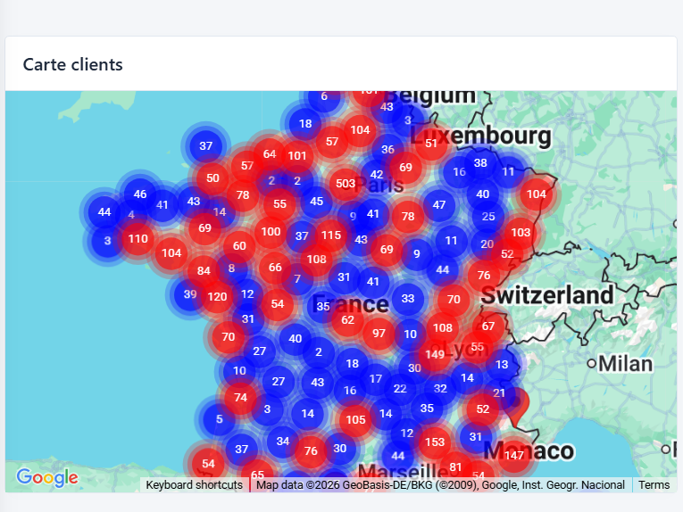
  </picture>

Charged with the design, implementation, deployment, and maintenance of a custom <abbr title="Customer Relationship Management">CRM</abbr> application that includes customer data processing, sales appointment scheduling and tracking, as well as order and invoice handling.

Non-exhaustive list of features:
- Online digital signature of customer orders.
- Real-time notification system with <a class="external-link" href="https://mercure.rocks/" target="_blank">Mercure</a>.
- Integration with third-party invoicing service.
- Handles different tax rates for mainland France and oversea territories.
- Automatic generation of multiple types of documents.
- Role-based permission system for users.

#### Tour agency management software

  
  
  
  
  

  <picture class="rounded border">
    <source srcset="assets/images/landing.webp" type="image/webp" />
    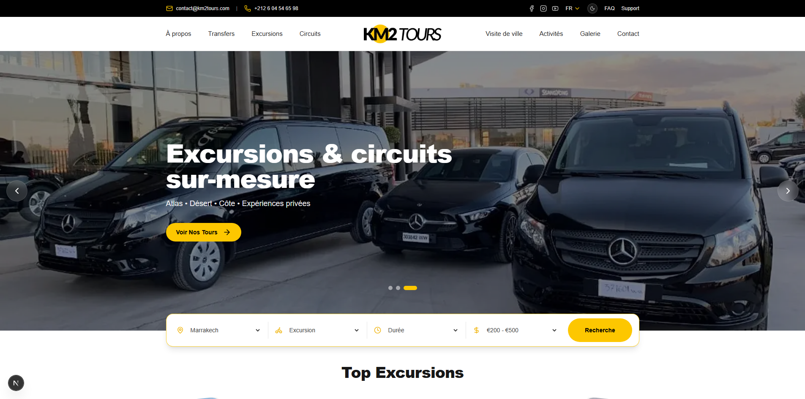
  </picture>

  <picture class="rounded border">
    <source srcset="assets/images/excursion_page_1.webp" type="image/webp" />
    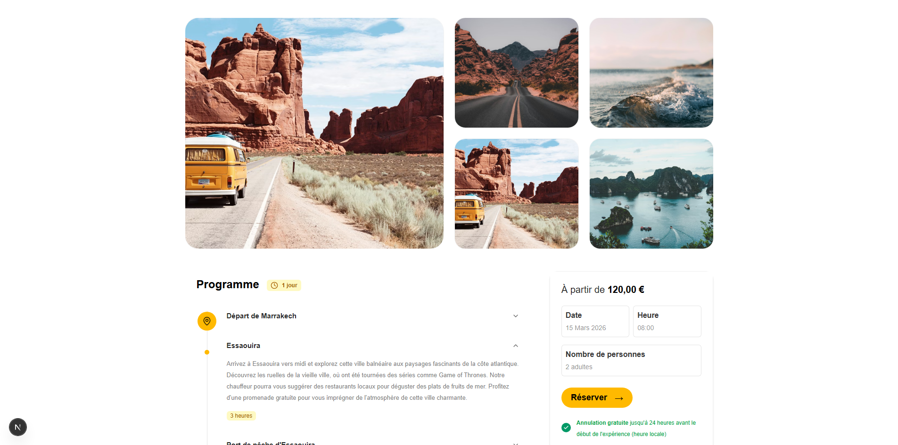
  </picture>

  <picture class="rounded border">
    <source srcset="assets/images/reservation_form.webp" type="image/webp" />
    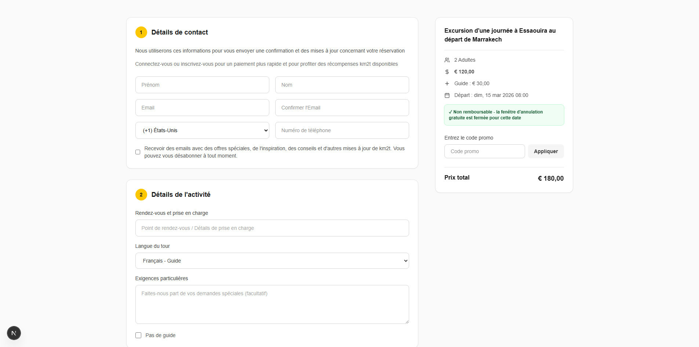
  </picture>

Tour agency management application comprising a public-facing website paired with a back office that allows authenticated users to dynamically modify the site's content and receive reservation requests from visitors through the web form.

### Personal projects

#### Library catalog

  
  <!--  -->
  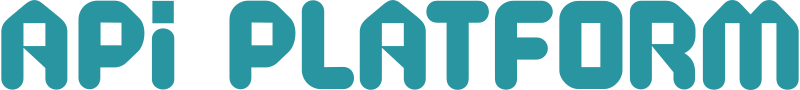
  
  
  

  <video autoplay muted playsinline preload="metadata" class="rounded border">
    <source src="assets/videos/library_catalog.mp4" type="video/mp4" />
    <source src="assets/videos/library_catalog.webm" type="video/webm" />
  </video>

  <picture class="rounded border">
    <source srcset="assets/images/library_book.webp" type="image/webp" />
    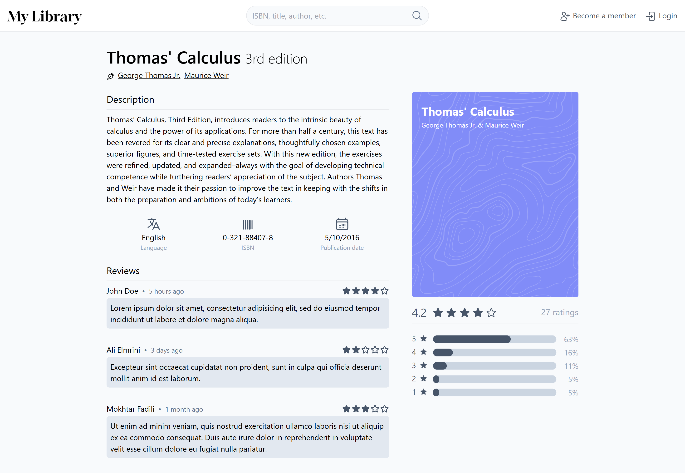
  </picture>

  <picture class="rounded border">
    <source srcset="assets/images/library_mobile.webp" type="image/webp" />
    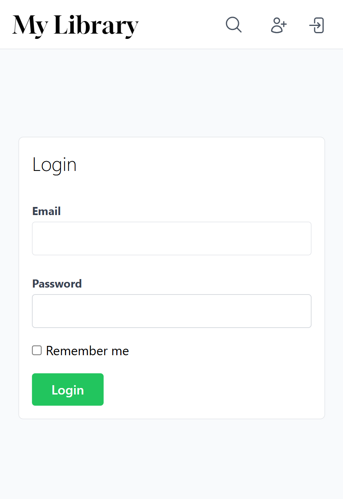
  </picture>

  <h4 id="3d-cube">3D cube</h4>
  <a class="view-code-button" href="https://github.com/kerpell/3d-cube" target="_blank">
    


    View code
  </a>

  
  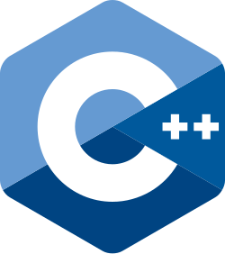

<video autoplay muted loop playsinline preload="metadata" class="" width="400" style="display: block;">
  <source src="assets/videos/cube.mp4" type="video/mp4" />
  <source src="assets/videos/cube.webm" type="video/webm" />
</video>

  <h4 id="archery-game">Checkers</h4>

  
  

<video autoplay muted loop playsinline preload="metadata" class="rounded border" style="display: block; max-width: 100%;">
  <source src="assets/videos/checkers.mp4" type="video/mp4" />
  <source src="assets/videos/checkers.webm" type="video/webm" />
</video>

  <h4 id="archery-game">Archery game</h4>

  
  

<video autoplay muted loop playsinline preload="metadata" class="rounded border" style="display: block; max-width: 100%;">
  <source src="assets/videos/archery.webm" type="video/webm" />
  <source src="assets/videos/archery.mp4" type="video/mp4" />
</video>

  <h4 id="sort-algorithms-visualization">Sort algorithms visualization</h4>
  <a class="view-code-button" href="https://github.com/kerpell/sort-visualization" target="_blank">
    


    View code
  </a>

  
  

<video autoplay muted loop playsinline preload="metadata" class="rounded border" style="display: block; max-width: 100%;">
  <source src="assets/videos/sort.mp4" type="video/mp4" />
  <source src="assets/videos/sort.webm" type="video/webm" />
</video>

  <h4 id="sierpiński-triangle">Sierpiński triangle</h4>
  <a class="view-code-button" href="https://github.com/kerpell/sierpinski-triangle" target="_blank">
    


    View code
  </a>

  

  <video autoplay muted loop playsinline preload="metadata" class="" style="display: block; width: 600px; max-width: 100%;">
    <source src="assets/videos/sierpinski.mp4" type="video/mp4" />
    <source src="assets/videos/sierpinski.webm" type="video/webm" />
  </video>

## References

  

    

      

        
      

    

  

  

    
Anass Karabila

    <small class="reference-title">Information system architect at Sofrecom, subsidiary of Orange Group.</small >
    

      
"I had the pleasure of working with Amine on the development of a Symfony/PHP CRM, and I can attest to his reliability, professionalism, and technical skills as a full-stack developer.

      
Beyond his complete mastery of PHP, he is a dedicated, reliable, and solution-oriented individual. He quickly grasps requirements, proposes relevant solutions, and works effectively as part of a team.

      
I highly recommend him for any project requiring a skilled and committed full-stack developer."

    

    <a class="external-link" href="https://www.linkedin.com/in/anasskarabila/" target="_blank">LinkedIn</a>
  

## Contact
For all inquiries, you can contact me at this e-mail address: <amine.devl@proton.me>